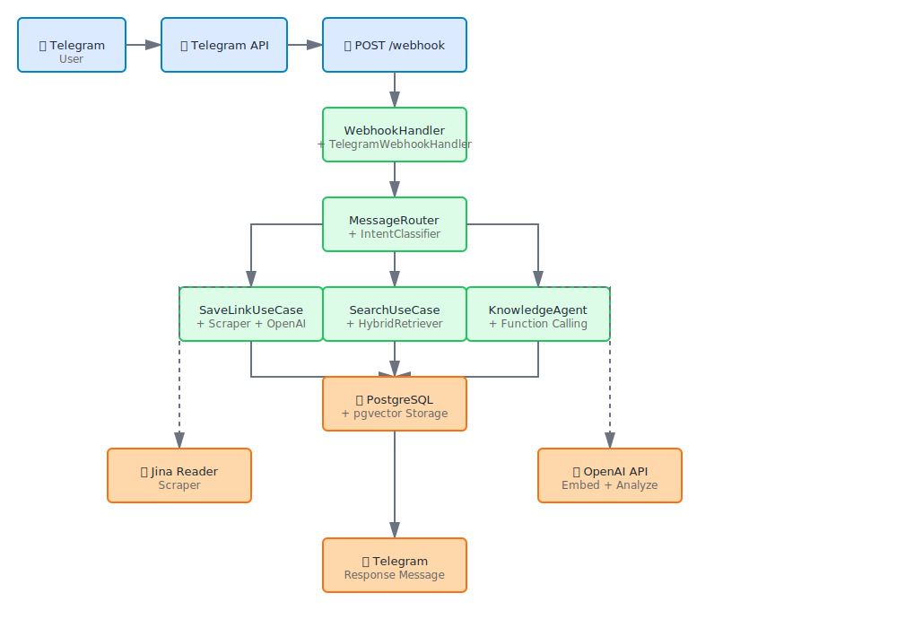
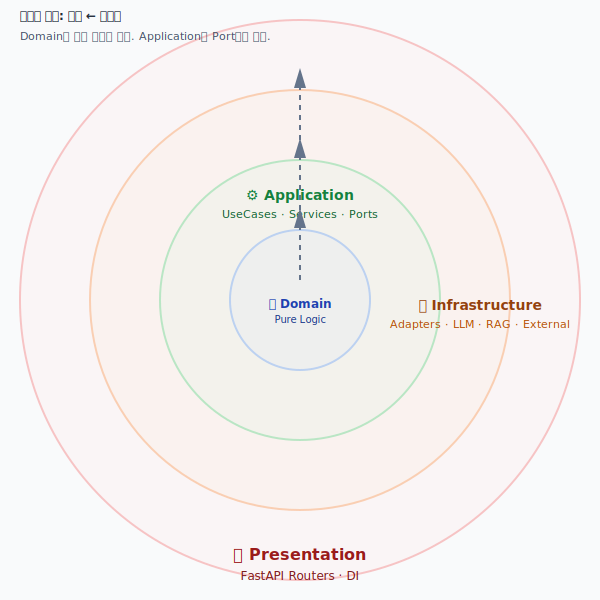

# LinkdBot-RAG

> Proactive AI Knowledge Copilot — Store user-shared links, convert to structured knowledge, detect interest drift, send proactive insights

[](https://www.python.org/downloads/)
[](https://fastapi.tiangolo.com/)
[](LICENSE)

---

## Demo

| Save Link Flow | Knowledge Agent (/ask) | Dashboard Home |
|:-:|:-:|:-:|
|  |  |  |
| Send any URL to Telegram bot → Auto-extract content, analyze with AI, store with vector embeddings, sync to Notion | Ask questions about your knowledge base → Hybrid search + AI agent answers with function calling → RAG-powered responses | Browse collected links, discover trends, manage personal knowledge library with smart filtering |

---

## Features

### Smart Link Collection
- Send any URL directly to the Telegram bot
- Auto-extract URLs from text messages
- Normalize URLs and prevent duplicates

### Intelligent Indexing
- Content scraping from URLs using Jina Reader
- Semantic analysis with OpenAI embeddings and keyword extraction

### Hybrid RAG Search
- Dense search (semantic similarity) + Sparse search (keyword matching)
- Rerank results with keyword overlap optimization for better accuracy

### Proactive Knowledge
- Interest drift detection based on activity patterns
- Reactivation scoring to resurface relevant old knowledge
- Weekly digest reports sent directly to Telegram

### Multi-Platform
- **Telegram Bot**: Primary interface (slash commands, auto-collection)
- **Notion Sync**: One-way export with user's Notion workspace (OAuth)
- **Streamlit Dashboard**: Personal knowledge library with analytics
- **REST API**: Full CRUD operations for programmatic access

---

## System Flow

The system processes messages in a multi-stage pipeline:

1. **Telegram Webhook** → Receives URL or text message
2. **WebhookHandler** → Extracts URLs and routes message type
3. **MessageRouter** → Classifies intent (SEARCH, MEMO, ASK, etc.)
4. **Parallel Processing** → Three independent flows:
   - **SaveLink** → Scrape, analyze, embed, store, sync Notion
   - **Search** → Hybrid retrieval, rerank, return top results
   - **Knowledge Agent** → Function calling with tools (search KB, get unread links)
5. **Response** → Send results back to Telegram user



---

## Architecture

LinkdBot-RAG uses **Pragmatic Clean Architecture** with dependency inversion:

```
    Presentation (API)
         ↓ Depends
    Application (UseCases + Services + Ports)
         ↓ Depends
    Domain (Pure Logic + Entities)
         ↓ Implements
    Infrastructure (Adapters + RAG + External I/O)
```

- **Domain**: Pure business logic (no imports of external libraries like FastAPI, DB, HTTP)
- **Application**: UseCase orchestration and Port interfaces for external systems
- **Infrastructure**: Repository implementations, LLM clients, external API adapters
- **Presentation**: FastAPI routers that depend only on Application layer via dependency injection



---

## Directory Structure

```
LinkdBot-RAG/
├── app/                          # FastAPI application
│   ├── main.py                   # Entry point
│   ├── models/                   # Pydantic request/response models
│   ├── utils/                    # Helper utilities
│   ├── core/                     # Core configuration
│   │   ├── config.py             # Settings (pydantic-settings)
│   │   └── jwt.py                # JWT authentication (Phase 4)
│   ├── domain/                   # Pure business logic (no external deps)
│   │   ├── entities/             # Data models (Link, User, Chunk)
│   │   └── repositories/         # Repository interfaces (ABC)
│   ├── application/              # Use cases & services
│   │   ├── ports/                # Abstract interfaces (Port/Adapter)
│   │   ├── agents/               # Agent implementations
│   │   ├── usecases/             # Business logic orchestration
│   │   └── services/             # Orchestration services
│   ├── infrastructure/           # External implementations
│   │   ├── repository/           # SQLAlchemy repository implementations
│   │   ├── llm/                  # LLM client implementations
│   │   ├── rag/                  # RAG pipeline (retrieval, ranking)
│   │   ├── adapters/             # External API adapters
│   │   └── external/             # External service clients
│   └── api/                      # HTTP routers & controllers
│       ├── v1/endpoints/         # API routes
│       └── dependencies/         # Dependency injection
├── dashboard/                    # Streamlit dashboard (Phase 4)
│   ├── app.py                    # Dashboard entry point
│   ├── api_client.py             # Backend API client
│   └── tabs/                     # Dashboard pages
├── tests/                        # Test suite
│   ├── test_*.py                 # Unit & integration tests
│   ├── test_webhook.http         # Webhook test requests
│   └── test_webhook.sh           # Webhook test script
├── docs/                         # Documentation
│   ├── assets/                   # Images & diagrams (SVG)
│   ├── troubleshooting/          # Troubleshooting guides
│   └── superpowers/              # OMC design docs & plans
├── alembic/                      # Database migrations
├── requirements.txt              # Python dependencies
├── docker-compose.yml            # Multi-container setup
└── .env.example                  # Environment variables template
```

---

## Getting Started

### Prerequisites
- Python 3.11+
- PostgreSQL 16 (with pgvector extension)
- OpenAI API key
- Telegram Bot token (from @BotFather)
- Notion OAuth credentials (optional, for Notion sync)

### Installation

1. **Clone the repository**
   ```bash
   git clone https://github.com/chanubc/LinkdBot-RAG.git
   cd LinkdBot-RAG
   ```

2. **Set up Python environment**
   ```bash
   python3.11 -m venv venv
   source venv/bin/activate  # macOS/Linux
   # or: venv\Scripts\activate  # Windows
   pip install -r requirements.txt
   ```

3. **Configure environment variables**
   ```bash
   cp .env.example .env
   # Edit .env with your credentials:
   # - DATABASE_URL: PostgreSQL connection
   # - OPENAI_API_KEY: OpenAI API key
   # - TELEGRAM_BOT_TOKEN: Telegram bot token
   # - TELEGRAM_WEBHOOK_URL: Your webhook URL
   ```

4. **Initialize database**
   ```bash
   alembic upgrade head
   ```

5. **Start the application**
   ```bash
   uvicorn app.main:app --reload --host 0.0.0.0 --port 8000
   ```

6. **(Optional) Start Streamlit dashboard**
   ```bash
   streamlit run dashboard/app.py
   ```

### Webhook Setup

1. Get your webhook URL: `https://your-domain.com/api/v1/webhooks/telegram`
2. Configure Telegram webhook:
   ```bash
   curl -X POST https://api.telegram.org/bot<YOUR_TOKEN>/setWebhook \
     -H "Content-Type: application/json" \
     -d '{"url": "https://your-domain.com/api/v1/webhooks/telegram"}'
   ```

### Quick Test

Send a URL to your Telegram bot:
```
https://example.com/article
```

Expected: Bot responds with extracted summary and stores the link.

---

## Troubleshooting

### Hybrid Search Performance Issues

**Problem**: Search results are slow or inaccurate.

**Solution**: Use optimized hybrid search with cutoff optimization.

For detailed hybrid search tuning and performance optimization, see [docs/troubleshooting/hybrid-search.md](docs/troubleshooting/hybrid-search.md).

### Common Issues

| Issue | Solution |
|-------|----------|
| `ModuleNotFoundError: dashboard` | Add `sys.path.insert(0, os.path.dirname(__file__))` to `dashboard/app.py` |
| `pgvector extension not found` | Install pgvector: `CREATE EXTENSION vector;` in PostgreSQL |
| `Telegram webhook not responding` | Verify webhook URL is publicly accessible and HTTPS |
| `OpenAI API errors` | Check API key and rate limits; see [OpenAI docs](https://platform.openai.com/docs) |
| `Notion sync fails` | Verify Notion OAuth token and page permissions |
| `Pydantic validation errors` | Check `.env` has all required variables; use `extra="ignore"` in Settings |

For more solutions, see the [Troubleshooting Guide](docs/troubleshooting/).

---

## License

This project is licensed under the MIT License — see the [LICENSE](LICENSE) file for details.

### Summary

- **Permissions**: Commercial use, modification, distribution, private use
- **Conditions**: License and copyright notice
- **Limitations**: No liability or warranty

For the full license text, see [LICENSE](LICENSE).
