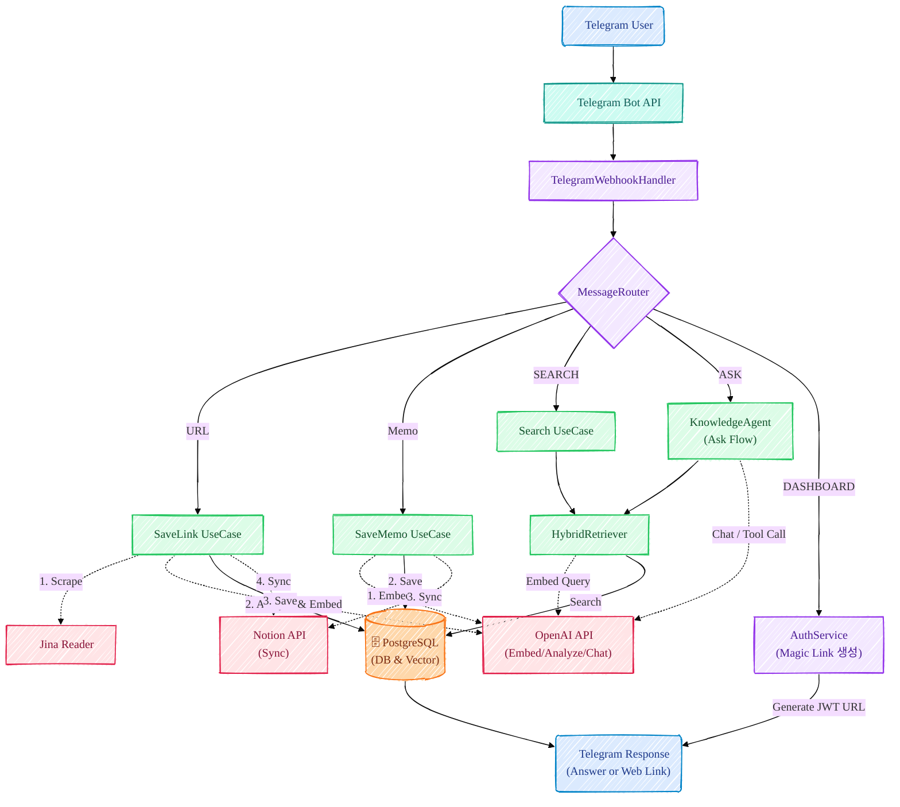
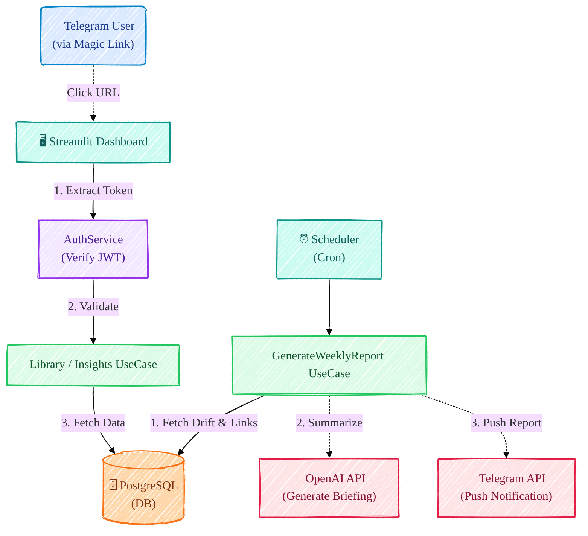
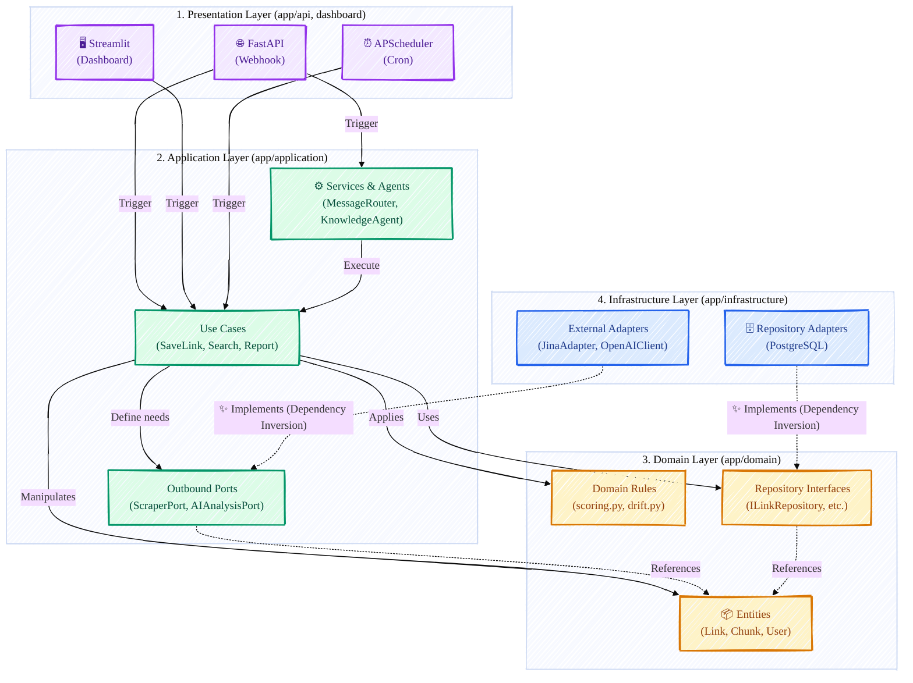

# LinkdBot-RAG

> Proactive AI Knowledge Copilot — Store user-shared links, convert to structured knowledge, detect interest drift, send proactive insights

[](https://www.python.org/downloads/)
[](https://fastapi.tiangolo.com/)
[](LICENSE)

---

## Demo

<table width="100%">
  <tr>
    <th width="33.33%">Link Save &amp; Notion Sync</th>
    <th width="33.33%">Hybrid RAG (Dense + Sparse)</th>
    <th width="33.33%">Knowledge Q&amp;A (`/ask`)</th>
  </tr>
  <tr>
    <td width="33.33%"></td>
    <td width="33.33%"></td>
    <td width="33.33%"></td>
  </tr>
  <tr>
    <td width="33.33%">본문 스크랩·요약 후 Notion DB까지 자동 동기화</td>
    <td width="33.33%">Dense+sparse retrieval과 reranking으로 관련 링크를 더 안정적으로 찾음</td>
    <td width="33.33%">저장된 링크와 메모를 바탕으로 근거 기반 답변 생성</td>
  </tr>
</table>

<table width="100%">
  <tr>
    <th width="33.33%">Proactive Weekly Report</th>
    <th width="33.33%">Dashboard Entry</th>
    <th width="33.33%">Quick Menu</th>
  </tr>
  <tr>
    <td width="33.33%"></td>
    <td width="33.33%"></td>
    <td width="33.33%"></td>
  </tr>
  <tr>
    <td width="33.33%">관심사 변화와 reactivation 신호를 바탕으로 다시 볼 링크를 선제적으로 추천</td>
    <td width="33.33%">`/dashboard` JWT magic link로 웹 dashboard에 안전하게 진입</td>
    <td width="33.33%">검색·질문·리포트·대시보드 이동을 버튼으로 빠르게 실행</td>
  </tr>
</table>

### Notion Knowledge Archive

Telegram에서 저장한 링크와 요약이 Notion DB에서 어떻게 구조화되는지 보여주는 화면입니다.

<p align="center">
  
</p>

<p align="center"><sub>저장된 링크, 요약, 메타데이터가 구조화된 knowledge archive</sub></p>

### Dashboard Views

웹 dashboard에서 저장한 지식을 탐색하고 회고하는 화면들입니다.

<table width="100%">
  <tr>
    <td width="50%"></td>
    <td width="50%"></td>
  </tr>
  <tr>
    <td width="50%">저장된 링크와 핵심 지표를 한눈에 보는 dashboard overview</td>
    <td width="50%">탐색 또는 인사이트 흐름을 보여주는 dashboard view</td>
  </tr>
  <tr>
    <td width="50%"></td>
    <td width="50%"></td>
  </tr>
  <tr>
    <td width="50%">검색·탐색·지표 확인을 지원하는 dashboard view</td>
    <td width="50%">관심사 변화나 분석 상세를 보여주는 dashboard view</td>
  </tr>
  <tr>
    <td width="50%"></td>
    <td width="50%"></td>
  </tr>
  <tr>
    <td width="50%">재발견과 분석을 보조하는 dashboard view</td>
    <td width="50%">라이브러리 탐색과 retrieval 보조 화면</td>
  </tr>
</table>
---

## Core Features

| Priority | Feature | Description |
|---|---|---|
| 1 | **Proactive Agent** | 사용자의 저장 패턴과 관심사 변화를 분석해 `drift`를 감지하고, `reactivation` 점수를 기반으로 다시 볼 만한 링크를 주간 리포트로 먼저 제안합니다. 이 프로젝트의 차별점이 가장 강하게 드러나는 영역입니다. |
| 2 | **Hybrid RAG (Dense + Sparse + Reranking)** | pgvector 기반 dense vector search와 keyword/FTS 기반 sparse search를 함께 사용하고, non-Kiwi BM25-style lexical recall path + reranking + cutoff optimization까지 적용해 관련 링크를 더 안정적으로 찾습니다. `/search` 품질뿐 아니라 `/ask` 답변 품질의 기반이 됩니다. |
| 3 | **지식 Q&A 에이전트** | `/ask` 요청 시 저장된 링크와 메모를 조회한 뒤 근거 기반 답변을 생성합니다. 단순 챗봇이 아니라 개인 지식 베이스를 활용하는 응답 흐름입니다. |
| 4 | **본문 스크랩 & Notion 요약 자동화** | 텔레그램에 링크만 보내면 해당 페이지의 본문 내용을 스크랩/크롤링하고, 요약·키워드·임베딩을 생성한 뒤 저장합니다. 이후 핵심 요약과 메타데이터를 Notion에도 자동 동기화해 다시 보기 쉬운 형태로 남깁니다. |
| 5 | **멀티 서피스 UX** | 텔레그램을 메인 인터페이스로 유지하면서, Streamlit 대시보드와 Notion을 보조 표면으로 연결해 탐색/회고/재사용을 돕습니다. |

### Hybrid RAG Architecture

Dense retrieval은 의미적으로 유사한 문서를 찾는 데 강하고, sparse retrieval은 키워드와 고유명사 같은 정확한 표현 매칭에 강합니다. 둘을 함께 쓰면 한쪽만 사용할 때 놓치기 쉬운 결과를 더 안정적으로 회수할 수 있고, reranking이 최종 문맥 적합도를 다시 정리해 `/search`와 `/ask`의 신뢰도를 높입니다.


### Why These Matter Most

1. **Proactive Agent (drift + reactivation)**  
   이 프로젝트를 “저장 앱”이 아니라 “먼저 챙겨주는 지식 코파일럿”으로 바꾸는 가장 중요한 기능입니다.

2. **Hybrid RAG (벡터 dense + 키워드 sparse + reranking)**  
   사람들이 바로 이해할 수 있는 표현으로 보면 “벡터 검색 + 키워드 검색” 조합이고, 그 위에 reranking과 cutoff optimization이 한 번 더 얹혀 있습니다. 검색 품질이 좋아야 질문 응답, 추천, 리포트가 전부 살아납니다.

3. **본문 스크랩과 Notion 요약 자동화**  
   아무리 추천과 검색이 좋아도 원문 지식이 제대로 쌓이지 않으면 가치가 없습니다. 링크 본문을 자동으로 읽고 요약해 Notion까지 정리해주는 흐름이 실사용성을 받쳐줍니다.

---

## Workflow

### Main Workflow

시스템은 아래와 같은 다단계 파이프라인으로 메시지를 처리합니다.

1. **Telegram Webhook** → URL 또는 일반 텍스트 메시지 수신
2. **WebhookHandler** → URL 추출 및 메시지 유형 분기
3. **MessageRouter** → 의도 분류 (`SEARCH`, `MEMO`, `ASK` 등)
4. **병렬 처리** → 세 가지 주요 흐름 실행
   - **SaveLink** → 스크랩, 분석, 임베딩, 저장, Notion 동기화
   - **Search** → Hybrid retrieval, rerank, 상위 결과 반환
   - **Knowledge Agent** → 도구 호출 기반 질의응답 (지식 검색, 미읽음 링크 조회 등)
5. **Response** → 결과를 Telegram 사용자에게 전송



### Dashboard Workflow

`/dashboard` 명령어 → Magic Link 생성(JWT) → Streamlit 대시보드 접근. APScheduler가 주기적으로 interest drift를 감지하고 주간 리포트를 생성하여 Telegram으로 전송.



---

## Architecture

LinkdBot-RAG는 의존성 역전을 적용한 **Clean Architecture**를 사용합니다.

```
    Presentation (API)
         ↓ Depends
    Application (UseCases + Services + Ports)
         ↓ Depends
    Domain (Pure Logic + Entities)
         ↓ Implements
    Infrastructure (Adapters + RAG + External I/O)
```

- **Domain**: Pure business logic (no imports of external libraries like FastAPI, DB, HTTP)
- **Application**: UseCase orchestration and Port interfaces for external systems
- **Infrastructure**: Repository implementations, LLM clients, external API adapters
- **Presentation**: FastAPI routers that depend only on Application layer via dependency injection



### System Infrastructure

GCP VM(chanu.shop) 위에서 Docker로 실행합니다. NGINX가 리버스 프록시 역할을 하며 FastAPI(:8000)와 Streamlit(:8501)을 서빙합니다.


### DB Schema

`USERS → LINKS → CHUNKS` 3-테이블 구조입니다. `LINKS`에는 summary embedding(Vector 1536)이 저장되고, `CHUNKS`에는 전문 검색용 TSVector와 청크 embedding이 저장됩니다.


---

## Directory Structure

```
LinkdBot-RAG/
├── app/
│   ├── api/            # FastAPI routers & dependency injection
│   ├── application/    # Use cases, services, ports (Port/Adapter)
│   ├── domain/         # Entities, repository interfaces (pure logic)
│   ├── infrastructure/ # DB, LLM, RAG, external API adapters
│   └── core/           # Config, JWT
├── dashboard/          # Streamlit (Home / Trends / Insights / Discover)
├── alembic/            # DB migrations
├── tests/
└── docs/
```

---

## Troubleshooting

### Hybrid Search Performance Issues

원문 분석 노트: [Hybrid RAG 50→80: Query Normalization + Kiwi Plugin](https://discreet-macaroni-d04.notion.site/Hybrid-RAG-50-80-Query-Normalization-Kiwi-Plugin-325302038605814d86a6deaea094468e?source=copy_link)

#### 📌 문제상황

##### 사용자 쿼리의 조사 + 복합어로 인한 검색 실패

**예: "롯데채용공고를 찾아줘"**

```text
Query: 롯데채용공고를
       |  복합어 |+| 조사 |
```

| 레이어 | 상태 | 문제 |
| --- | --- | --- |
| **Dense (pgvector)** | ✅ OK | "채용", "공고" 의미는 어느 정도 포착 가능 |
| **Sparse (FTS)** | ❌ 실패 | "롯데채용공고를"이 단일 토큰으로 잡혀 "채용", "공고" 토큰이 없음 |
| **Keyword Rescoring** | ❌ 실패 | raw token "롯데채용공고를" ≠ "롯데" keyword → 순위 상승 불가 |

**결과**: Dense 신호만으로는 부족해 상관없는 문서도 상위에 노출될 수 있습니다.

#### 🔧 해결방안 (4가지)

| 방법 | 핵심 아이디어 | 효과 |
| --- | --- | --- |
| **1. LLM 기반 Keyword Mapping** | 링크 저장 시 LLM이 핵심 keyword를 추출해 `keywords` 필드에 저장 | "채용", "공고", "롯데" 같은 핵심 단어를 안정적으로 매칭 |
| **2. Title Fallback** | keyword 매칭이 안 되면 제목에서 substring 검색 | keyword 추출 실패 문서도 제목으로 부분 복구 |
| **3. Query Normalization** | 조사 제거, compact, bi-gram, morpheme 변형 생성 | 복합어/조사 때문에 실패하던 쿼리를 분해해 매칭 가능 |
| **4. Best Variant Selection** | 모든 쿼리 변형 중 overlap이 가장 높은 variant를 선택 | 어느 변형이든 하나만 잘 맞아도 안정적으로 점수 반영 |

#### 📊 성과

##### 실제 사용자 쿼리 10개 벤치마크

| 지표 | Before | Query Normalization + Keyword Rescoring | Kiwi Plugin: Sparse Morpheme FTS |
| --- | --- | --- | --- |
| **Top-1 정확도** | 50% (5/10) | **80% (8/10)** | **80% (8/10)** |
| **MRR** | 0.65 | **0.85** | **0.85** |
| **P@5** | 0.46 | **0.52** | **0.52** |
| **NDCG@5** | 0.5758 | **0.7523** | **0.7523** |

**핵심 해석**

- **Phase A (Query Normalization + Keyword Rescoring)** 가 체감 성능 개선의 대부분을 담당
- **Kiwi Plugin (Sparse morpheme FTS)** 은 이 벤치마크 기준 추가 기여가 거의 없었음
- 결과적으로 현재 Hybrid RAG 파이프라인에서는 **Dense + Keyword layer** 가 핵심 개선 포인트였음

##### 추가 개선 (2026-03-11)

| 지표 | Dense-only | PR#68 | Today | PR#68↑ | Today 추가↑ | 누적↑ |
| --- | --- | --- | --- | --- | --- | --- |
| **MRR** | 0.2952 | 0.7357 | **0.9286** | +149% | +26% | **+214%** |
| **NDCG@5** | 0.4737 | 0.7813 | **0.9415** | +65% | +21% | **+99%** |
| **신규 케이스 1위** | 0/4 | 0/4 | **4/4** | — | **+100%** | — |

**추가 개선 포인트**

1. **link_id dedupe** — 동일 링크의 여러 chunk 중 최고 점수만 유지
2. **query variant 생성** — 원문 + 공백 제거 + bi-gram 결합으로 복합어 대응
3. **substring keyword 매칭** — query token이 keyword 내부에 포함될 때만 허용해 false positive 방지

자세한 설계 배경, variant 전략, 메트릭 해석은 위 Notion 문서를 참고하세요.

### Common Issues

| Issue | Solution |
|-------|----------|
| `ModuleNotFoundError: dashboard` | Add `sys.path.insert(0, os.path.dirname(__file__))` to `dashboard/app.py` |
| `pgvector extension not found` | Install pgvector: `CREATE EXTENSION vector;` in PostgreSQL |
| `Telegram webhook not responding` | Verify webhook URL is publicly accessible and HTTPS |
| `OpenAI API errors` | Check API key and rate limits; see [OpenAI docs](https://platform.openai.com/docs) |
| `Notion sync fails` | Verify Notion OAuth token and page permissions |
| `Pydantic validation errors` | Check `.env` has all required variables; use `extra="ignore"` in Settings |

더 많은 해결 방법은 [Troubleshooting Guide](docs/troubleshooting/)를 참고하세요.

---

## Tech Stack

| Category | Technology |
|----------|-----------|
| **Backend** | Python 3.11+ · FastAPI (Async) · SQLAlchemy |
| **Database** | PostgreSQL 16 + pgvector |
| **AI / LLM** | OpenAI GPT-4.1 · text-embedding-3-small (1536 dims) · Jina Reader |
| **Hybrid RAG** | Dense (pgvector cosine) + Sparse (Full-Text Search) + Rerank |
| **Integrations** | Telegram Bot API (Webhook) · Notion API (OAuth 2.0 + Page Sync) |
| **Frontend** | Streamlit |
| **Scheduler** | APScheduler |
| **Security** | Fernet · JWT |
| **Infrastructure** | GCP VM · Docker · NGINX · GitHub Actions |
| **Testing** | pytest |

---

## License

이 프로젝트는 MIT License를 따릅니다. 자세한 내용은 [LICENSE](LICENSE)를 참고하세요.

### Summary

- **Permissions**: Commercial use, modification, distribution, private use
- **Conditions**: License and copyright notice
- **Limitations**: No liability or warranty

전체 라이선스 본문은 [LICENSE](LICENSE)를 참고하세요.
