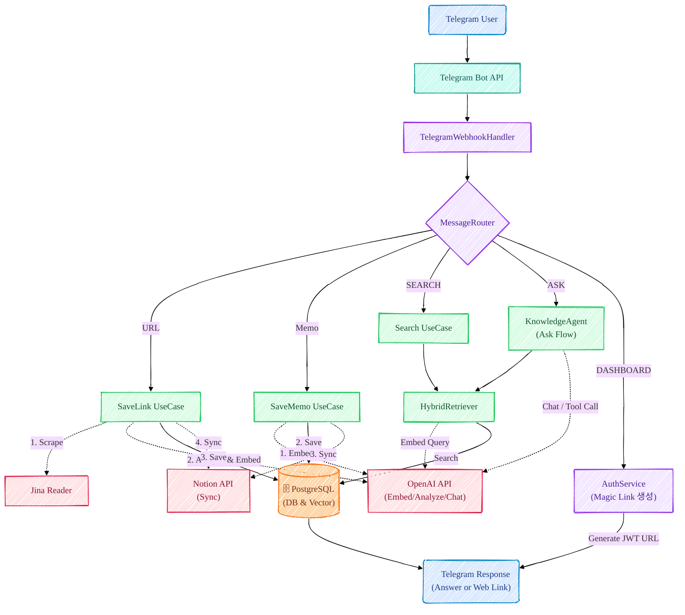
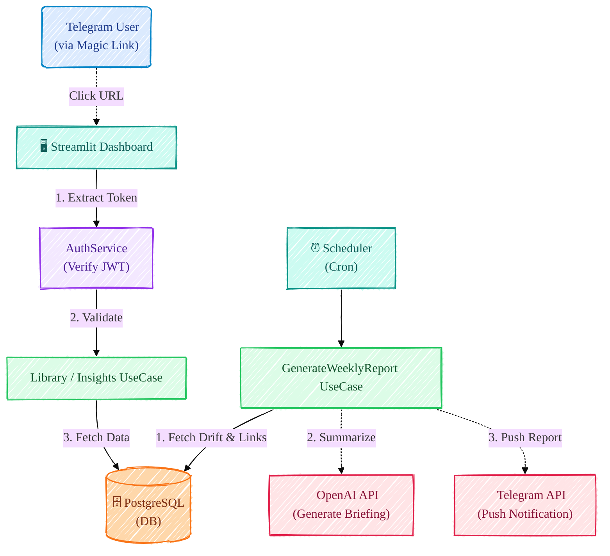
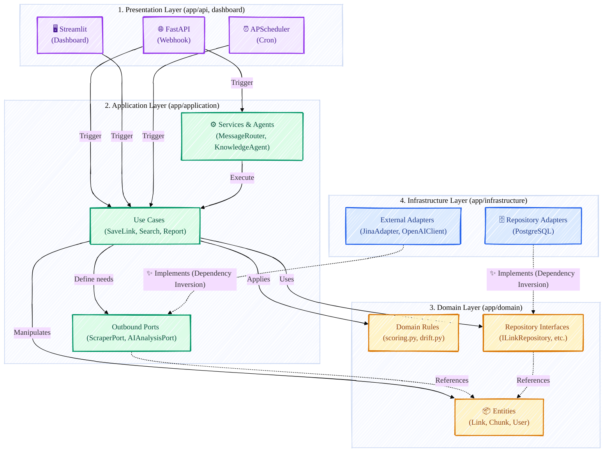

# LinkdBot-RAG

> Proactive AI Knowledge Copilot — Store user-shared links, convert to structured knowledge, detect interest drift, send proactive insights

[](https://www.python.org/downloads/)
[](https://fastapi.tiangolo.com/)
[](LICENSE)

---

## Demo

| Save Link Flow | Knowledge Agent (/ask) | Dashboard Home |
|:-:|:-:|:-:|
|  |  |  |
| Send any URL to Telegram bot → Auto-extract content, analyze with AI, store with vector embeddings, sync to Notion | Ask questions about your knowledge base → Hybrid search + AI agent answers with function calling → RAG-powered responses | Browse collected links, discover trends, manage personal knowledge library with smart filtering |

---

## Features

### Smart Link Collection
- Send any URL directly to the Telegram bot
- Auto-extract URLs from text messages
- Normalize URLs and prevent duplicates

### Intelligent Indexing
- Content scraping from URLs using Jina Reader
- Semantic analysis with OpenAI embeddings and keyword extraction

### Hybrid RAG Search
- Dense search (semantic similarity) + Sparse search (keyword matching)
- Rerank results with keyword overlap optimization for better accuracy

### Proactive Knowledge
- Interest drift detection based on activity patterns
- Reactivation scoring to resurface relevant old knowledge
- Weekly digest reports sent directly to Telegram

### Multi-Platform
- **Telegram Bot**: Primary interface (slash commands, auto-collection)
- **Notion Sync**: One-way export with user's Notion workspace (OAuth)
- **Streamlit Dashboard**: Personal knowledge library with analytics
- **REST API**: Full CRUD operations for programmatic access

---

## Workflow

### Main Workflow

The system processes messages in a multi-stage pipeline:

1. **Telegram Webhook** → Receives URL or text message
2. **WebhookHandler** → Extracts URLs and routes message type
3. **MessageRouter** → Classifies intent (SEARCH, MEMO, ASK, etc.)
4. **Parallel Processing** → Three independent flows:
   - **SaveLink** → Scrape, analyze, embed, store, sync Notion
   - **Search** → Hybrid retrieval, rerank, return top results
   - **Knowledge Agent** → Function calling with tools (search KB, get unread links)
5. **Response** → Send results back to Telegram user



### Dashboard Workflow

`/dashboard` 명령어 → Magic Link 생성(JWT) → Streamlit 대시보드 접근. APScheduler가 주기적으로 interest drift를 감지하고 주간 리포트를 생성하여 Telegram으로 전송.



---

## Architecture

LinkdBot-RAG uses **Clean Architecture** with dependency inversion:

```
    Presentation (API)
         ↓ Depends
    Application (UseCases + Services + Ports)
         ↓ Depends
    Domain (Pure Logic + Entities)
         ↓ Implements
    Infrastructure (Adapters + RAG + External I/O)
```

- **Domain**: Pure business logic (no imports of external libraries like FastAPI, DB, HTTP)
- **Application**: UseCase orchestration and Port interfaces for external systems
- **Infrastructure**: Repository implementations, LLM clients, external API adapters
- **Presentation**: FastAPI routers that depend only on Application layer via dependency injection



### System Infrastructure

GCP VM(chanu.shop) 위에서 Docker로 실행. NGINX가 리버스 프록시 역할을 하며 FastAPI(:8000)와 Streamlit(:8501)을 서빙.


### DB Schema

`USERS → LINKS → CHUNKS` 3-테이블 구조. `LINKS`에 summary embedding(Vector 1536)이 저장되고, `CHUNKS`에 전문 검색용 TSVector와 청크 embedding이 저장됨.


---

## Directory Structure

```
LinkdBot-RAG/
├── app/
│   ├── api/            # FastAPI routers & dependency injection
│   ├── application/    # Use cases, services, ports (Port/Adapter)
│   ├── domain/         # Entities, repository interfaces (pure logic)
│   ├── infrastructure/ # DB, LLM, RAG, external API adapters
│   └── core/           # Config, JWT
├── dashboard/          # Streamlit (Home / Trends / Insights / Discover)
├── alembic/            # DB migrations
├── tests/
└── docs/
```

---

## Troubleshooting

### Hybrid Search Performance Issues

**Problem**: Search results are slow or inaccurate.

**Solution**: Use optimized hybrid search with cutoff optimization.

For detailed hybrid search tuning and performance optimization, see [docs/troubleshooting/hybrid-search.md](docs/troubleshooting/hybrid-search.md).

### Common Issues

| Issue | Solution |
|-------|----------|
| `ModuleNotFoundError: dashboard` | Add `sys.path.insert(0, os.path.dirname(__file__))` to `dashboard/app.py` |
| `pgvector extension not found` | Install pgvector: `CREATE EXTENSION vector;` in PostgreSQL |
| `Telegram webhook not responding` | Verify webhook URL is publicly accessible and HTTPS |
| `OpenAI API errors` | Check API key and rate limits; see [OpenAI docs](https://platform.openai.com/docs) |
| `Notion sync fails` | Verify Notion OAuth token and page permissions |
| `Pydantic validation errors` | Check `.env` has all required variables; use `extra="ignore"` in Settings |

For more solutions, see the [Troubleshooting Guide](docs/troubleshooting/).

---

## License

This project is licensed under the MIT License — see the [LICENSE](LICENSE) file for details.

### Summary

- **Permissions**: Commercial use, modification, distribution, private use
- **Conditions**: License and copyright notice
- **Limitations**: No liability or warranty

For the full license text, see [LICENSE](LICENSE).
