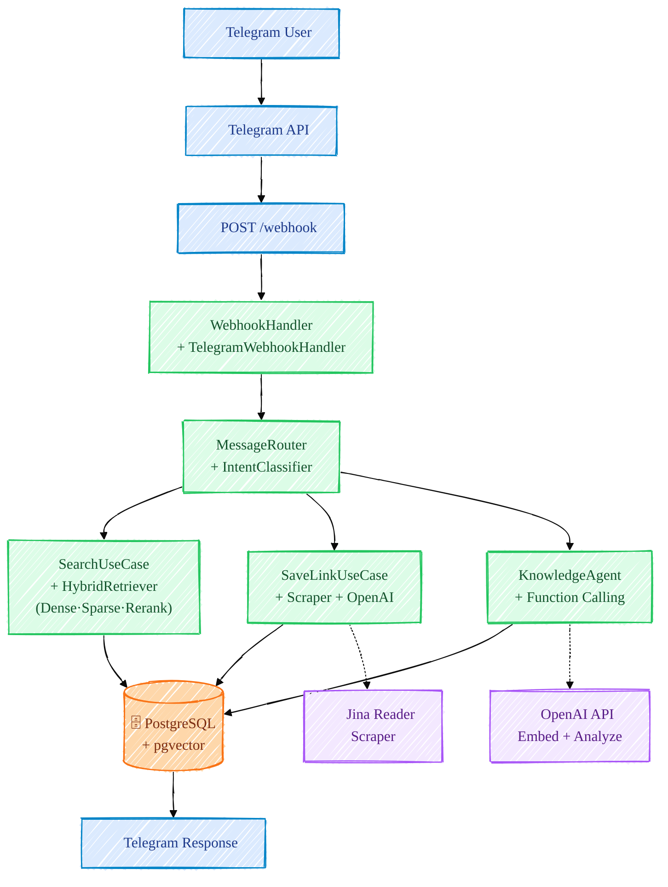

# System Flow (Message Processing Pipeline)

Processing flow: Telegram messages → Scraping → AI Analysis → Storage → Response

## Diagram

```mermaid
%%{init: {"theme": "base", "look": "handDrawn", "themeVariables": {"fontFamily": "Comic Sans MS"}}}%%
flowchart TD
    classDef input fill:#dbeafe,stroke:#0284c7,color:#1e3a8a
    classDef process fill:#dcfce7,stroke:#22c55e,color:#14532d
    classDef storage fill:#fed7aa,stroke:#f97316,color:#7c2d12
    classDef external fill:#f3e8ff,stroke:#a855f7,color:#581c87

    A[👤 Telegram User]:::input
    B[📱 Telegram API]:::input
    C[🔗 POST /webhook]:::input
    D[WebhookHandler<br/>+ TelegramWebhookHandler]:::process
    E[MessageRouter<br/>+ IntentClassifier]:::process
    F[SaveLinkUseCase<br/>+ Scraper + OpenAI]:::process
    G["SearchUseCase<br/>+ HybridRetriever<br/>(Dense·Sparse·Rerank)"]:::process
    H[KnowledgeAgent<br/>+ Function Calling]:::process
    I[(🗄️ PostgreSQL<br/>+ pgvector)]:::storage
    J[🧪 Jina Reader<br/>Scraper]:::external
    K[🤖 OpenAI API<br/>Embed + Analyze]:::external
    L[💬 Telegram Response]:::input

    A --> B --> C --> D --> E
    E --> G & F & H
    F & G & H --> I
    I --> L
    F -.-> J
    H -.-> K
```
