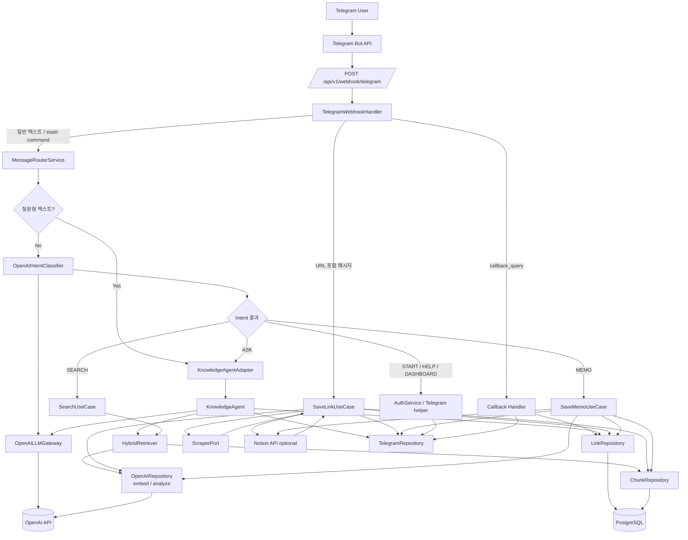
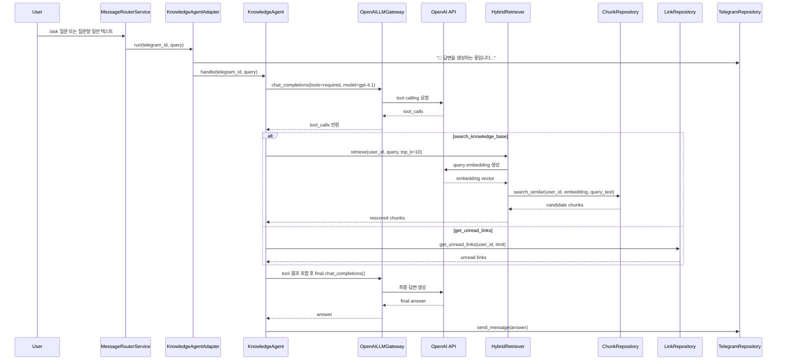

# Current Architecture UI (Mermaid)

현재 코드 기준의 **실제 노드/데이터 흐름**을 Mermaid로 정리한 문서입니다.  
이 문서는 **LangGraph 설계안이 아니라**, 지금 `app/` 아래에서 실행되는 구조를 기준으로 작성했습니다.

## 보기 좋은 방법

- **VS Code**: 이 파일 열기 → `Markdown: Open Preview`
- **GitHub**: markdown 렌더링에서 Mermaid 지원 시 바로 확인 가능
- **Mermaid Live Editor**: 다이어그램 블록만 복사해서 붙여넣기

---

## 1) 전체 시스템 흐름



---

## 2) 질문 처리 / Agent 흐름



---

## 3) 링크 저장 + 임베딩 + 인덱싱 흐름

```mermaid
flowchart TB
    msg[Telegram message with URL] --> handler[TelegramWebhookHandler]
    handler --> extract[extract_urls()]
    extract --> saveLink[SaveLinkUseCase.execute]

    saveLink --> normalize[normalize_url]
    normalize --> dupCheck{already exists?}

    dupCheck -->|Yes| telegram[TelegramRepository<br/>send_message]
    dupCheck -->|No| startMsg["'링크 저장 중' 메시지"]

    startMsg --> scrape[ScraperPort.scrape(url)]
    scrape --> content[content + content_source]
    content --> analyze[OpenAIRepository.analyze_content]
    analyze --> meta[title / summary / category / keywords]

    meta --> split{content_source == jina?}
    split -->|Yes| mdSplit[split_markdown]
    split -->|No| textSplit[split_chunks]

    mdSplit --> embedInputs[summary + raw_chunks]
    textSplit --> embedInputs
    embedInputs --> embed[OpenAIRepository.embed]
    embed --> saveLinkRow[LinkRepository.save_link]
    saveLinkRow --> saveChunks[ChunkRepository.save_chunks]
    saveChunks --> commit[DB commit]

    commit --> notion{Notion 연동 가능?}
    notion -->|Yes| notionSave[Notion create_database_entry]
    notion -->|No| done[완료 메시지]

    notionSave --> done
    done --> telegram
```

---

## 4) 메모 저장 흐름

```mermaid
flowchart LR
    userMemo[User memo] --> router[MessageRouterService]
    router --> saveMemo[SaveMemoUseCase.execute]
    saveMemo --> tg1[Telegram: 저장 중 메시지]
    saveMemo --> saveMemoRow[LinkRepository.save_memo]
    saveMemoRow --> split[split_chunks(memo)]
    split --> embed[OpenAIRepository.embed]
    embed --> saveChunks[ChunkRepository.save_chunks]
    saveChunks --> commit[DB commit]
    commit --> notion{Notion 연동 가능?}
    notion -->|Yes| notionSave[Notion create_database_entry]
    notion -->|No| tg2[Telegram: 저장 완료]
    notionSave --> tg2
```

---

## 5) 검색 흐름

```mermaid
flowchart LR
    query[User query] --> searchUC[SearchUseCase]
    searchUC --> retriever[HybridRetriever.retrieve]
    retriever --> embed[OpenAIRepository.embed(query)]
    embed --> chunkRepo[ChunkRepository.search_similar]
    chunkRepo --> rescoring[_rescore_with_keywords]
    rescoring --> dedupe[_dedupe_by_link]
    dedupe --> cutoff[_apply_score_cutoff]
    cutoff --> reranker[SimpleReranker.rerank]
    reranker --> results[Top-K results]
```

---

## 6) 현재 주요 실행 노드 요약

- **Webhook entry**
  - `app/api/v1/endpoints/webhook.py`
  - `app/application/services/telegram_webhook_handler.py`
- **Message routing**
  - `app/application/services/message_router_service.py`
- **Agent**
  - `app/application/agents/knowledge_agent.py`
  - `app/infrastructure/adapters/knowledge_agent_adapter.py`
- **LLM**
  - `app/infrastructure/llm/openai_llm_gateway.py`
  - `app/infrastructure/llm/openai_client.py`
- **RAG**
  - `app/infrastructure/rag/retriever.py`
  - `app/infrastructure/rag/reranker.py`
- **Use cases**
  - `app/application/usecases/save_link_usecase.py`
  - `app/application/usecases/save_memo_usecase.py`
  - `app/application/usecases/search_usecase.py`

---

## 7) 한 줄 결론

- 현재 구조는 **LangGraph 노드 그래프**가 아니라
- **Webhook → Router → UseCase / Custom Agent → OpenAI / DB** 형태의
- **서비스 + 포트/어댑터 기반 파이프라인**입니다.
