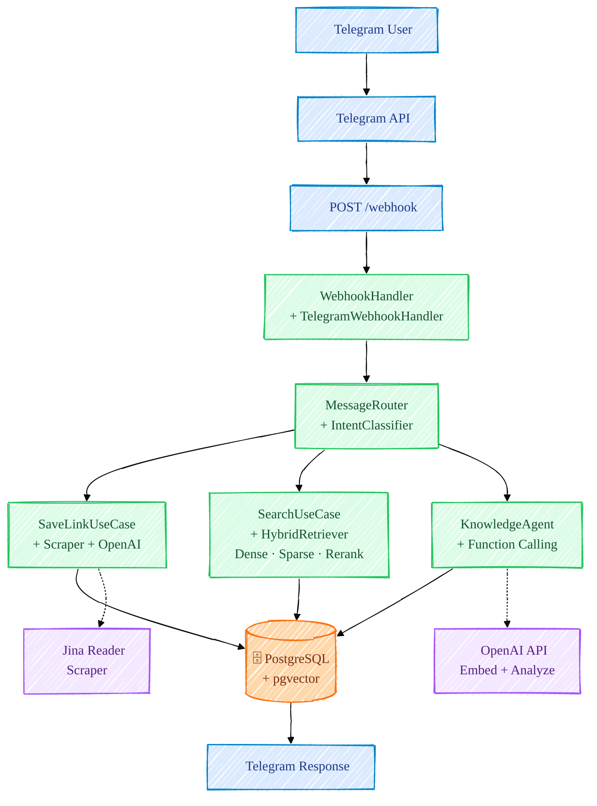
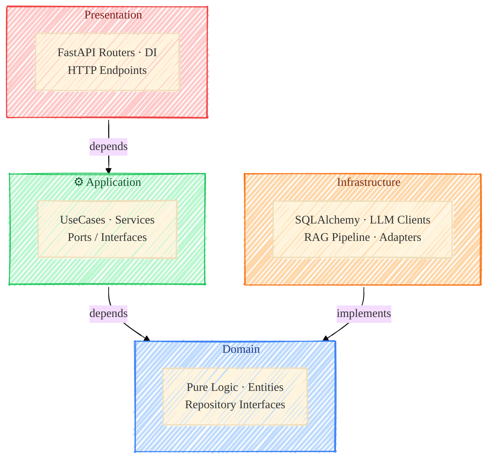

# Diagram Conversion Design — Mermaid Handdrawn Theme

**Date:** 2026-03-15
**Status:** Approved
**Scope:** Convert `system-flow.svg` and `clean-architecture.svg` to Mermaid format with handdrawn sketch theme

---

## Objective

Replace static SVG architecture diagrams with Mermaid diagrams using `look: "handDrawn"` + `theme: "base"` for a sketchy, informal visual style while maintaining clarity and reducing maintenance burden (Git diff-friendly text instead of binary SVG).

---

## Current State

| File | Type | Location | Diagram Type |
|------|------|----------|--------------|
| `system-flow.svg` | SVG | `docs/assets/` | Message processing pipeline (Telegram → Webhook → UseCase → DB) |
| `clean-architecture.svg` | SVG | `docs/assets/` | Concentric circles (Clean Architecture layers) |
| `archi-flow.xml` | SVG (mislabeled) | `docs/assets/` | Duplicate of system-flow.svg (to be deleted) |

---

## Design Decisions

### 1. **Format: Mermaid with Handdrawn Theme**

**Choice:** Mermaid with `look: "handDrawn"` + `theme: "base"`

**Reasoning:**
- GitHub-native rendering (no external tools)
- Sketch theme makes diagrams feel informal/approachable
- Git diff-friendly (plain text, not binary SVG)
- Easy to maintain and iterate

**Init Directive:**
```mermaid
%%{init: {"theme": "base", "look": "handDrawn", "themeVariables": {"fontFamily": "Comic Sans MS"}}}%%
```

---

### 2. **Scope: Two Diagrams**

**Include:** `system-flow.svg` + `clean-architecture.svg`
**Delete:** `archi-flow.xml` (duplicate of updated system-flow)

---

### 3. **Storage Location: Separate .md Files**

**Format:**
- `docs/assets/system-flow.md` — Mermaid code + title + description
- `docs/assets/clean-architecture.md` — Mermaid code + title + description

**Rationale:**
- Text-based (Git-friendly)
- README links to .md files instead of embedding SVG images
- Easy to view/edit in any Markdown editor
- Source of truth for diagram logic

---

### 4. **system-flow.md — Pipeline with Layer Colors**

**Diagram Type:** `flowchart TD` (vertical, top-down)

**Layers & Colors:**
| Layer | Color | Components |
|-------|-------|------------|
| **Input** (Blue) | `#dbeafe` | Telegram User, API, Webhook endpoint |
| **Process** (Green) | `#dcfce7` | Handler, Router, UseCases (SaveLink, Search, KnowledgeAgent) |
| **Storage** (Orange) | `#fed7aa` | PostgreSQL + pgvector |
| **External** (Purple) | `#f3e8ff` | Jina Reader, OpenAI API |

**Key Elements:**
- **SaveLinkUseCase** → Jina Reader (dashed edge)
- **SearchUseCase** → Enhanced with **HybridRetriever** label breakdown: "Dense · Sparse · Rerank" (shows full RAG pipeline)
- **KnowledgeAgent** → OpenAI API (dashed edge)
- All converge to **PostgreSQL** → single **Telegram Response** output

**Mermaid Code:**


---

### 5. **clean-architecture.md — Layers with Subgraph**

**Diagram Type:** `flowchart TD` + `subgraph` (not pure vertical due to diamond dependency shape, but subgraphs clarify layer structure)

**Layers & Colors:**
| Layer | Color | Responsibility |
|-------|-------|-----------------|
| **Presentation** (Red) | `#fecaca` | FastAPI Routers, DI, HTTP endpoints |
| **Application** (Green) | `#bbf7d0` | UseCases, Services, Port interfaces (ABC) |
| **Domain** (Blue) | `#bfdbfe` | Pure logic, Entities, Repository interfaces |
| **Infrastructure** (Orange) | `#fed7aa` | SQLAlchemy repos, LLM clients, RAG, External adapters |

**Dependency Flow:**
```
Presentation → Application → Domain
                              ↑
                        Infrastructure (implements)
```

**Mermaid Code:**


---

## Implementation Plan

### Phase 1: Create Markdown Files

1. Create `docs/assets/system-flow.md`
   - Paste Mermaid code from design above
   - Add title: `# System Flow (Message Processing Pipeline)`
   - Add intro paragraph explaining the flow
2. Create `docs/assets/clean-architecture.md`
   - Paste Mermaid code from design above
   - Add title: `# Clean Architecture (Layer Dependencies)`
   - Add layer descriptions

### Phase 2: Update README.md

- Replace SVG image references:
  ```markdown
  <!-- Old -->
  
  

  <!-- New -->
  [System Flow Diagram](docs/assets/system-flow.md)
  [Architecture Diagram](docs/assets/clean-architecture.md)
  ```

### Phase 3: Cleanup

- Delete `docs/assets/system-flow.svg`
- Delete `docs/assets/clean-architecture.svg`
- Delete `docs/assets/archi-flow.xml`

### Phase 4: Verification

- Open README in browser to verify Mermaid rendering
- Test on GitHub (should auto-render in Markdown preview)
- Verify links navigate to `.md` files correctly

---

## Testing Strategy

- [ ] Mermaid code renders correctly in Mermaid Live Editor
- [ ] Diagrams render correctly in GitHub README preview
- [ ] Links in README navigate to `.md` files (file exists + accessible)
- [ ] No broken image references in README
- [ ] Git diff shows clean text-based changes (not binary)

---

## Risks & Mitigation

| Risk | Mitigation |
|------|-----------|
| Mermaid rendering differs from SVG | Test both before deletion; screenshot original for reference |
| GitHub Mermaid version outdated | Stick to core features (flowchart, subgraph, classDef); avoid bleeding-edge syntax |
| Links to .md files break | Verify file paths relative to README location |

---

## Success Criteria

✅ **Diagrams render correctly** with handdrawn sketch theme
✅ **Colors match design** (input/process/storage/external layers)
✅ **HybridRetriever** breakdown visible (Dense · Sparse · Rerank)
✅ **Architecture layers** clearly labeled and color-coded
✅ **README links** point to .md files and function
✅ **Git history** shows text-based diffs, not binary changes
✅ **No broken references** in documentation

---

## Files Affected

**Created:**
- `docs/assets/system-flow.md`
- `docs/assets/clean-architecture.md`

**Modified:**
- `README.md` (diagram references)

**Deleted:**
- `docs/assets/system-flow.svg`
- `docs/assets/clean-architecture.svg`
- `docs/assets/archi-flow.xml`
